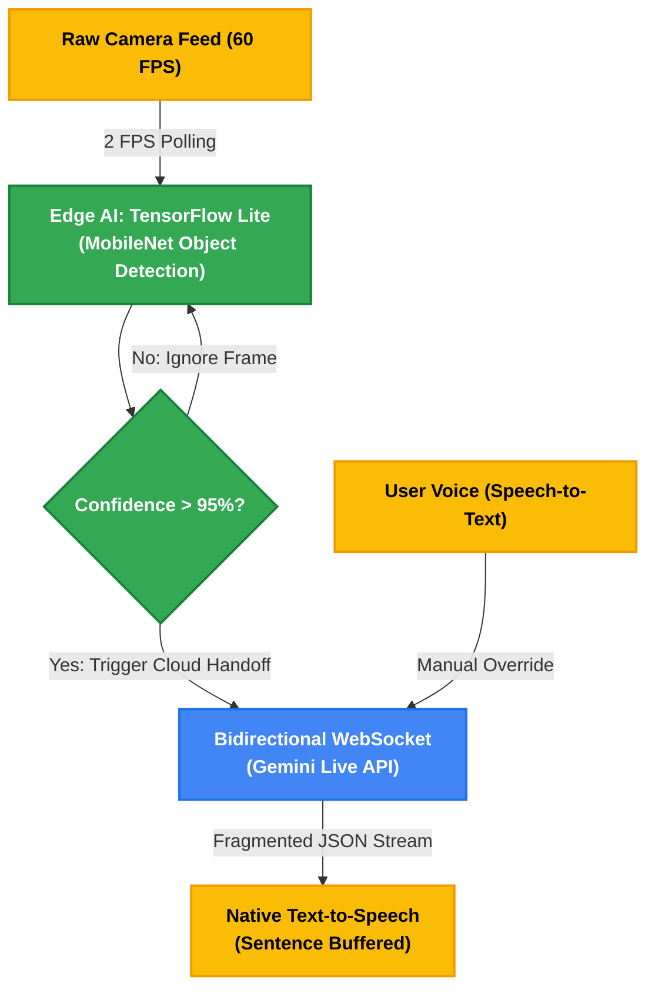

# 👁️ Gemini Lens: Hybrid Edge-to-Cloud Multimodal Agent

Gemini Lens is a real-time, voice-activated multimodal AI assistant built in Flutter. It replicates the complex stateful interactions of enterprise AI agents (like Gemini Live) by combining continuous on-device environmental scanning with low-latency conversational cloud responses.

This project was built to demonstrate advanced mobile architecture, specifically focusing on **Hybrid Edge-to-Cloud ML pipelines**, **WebSocket streaming**, and **asynchronous hardware thread management**.

---

## 🧠 System Architecture

To minimize cloud compute costs, reduce network payloads, and preserve battery life, this project implements a **Hybrid Edge-to-Cloud Pipeline**.



### 1. Edge Inference Loop (TensorFlow Lite)
Streaming raw video to a cloud LLM continuously is financially unscalable. Instead, a local continuous loop processes camera frames at 2 FPS using a lightweight on-device object detection model (`MobileNet` via `tflite_flutter`). This runs entirely offline with zero network latency. *(Note: In the Web prototype branch, the C++ FFI binding is stubbed via `MockEdgeDetector` to bypass browser compilation limits).*

### 2. Cloud Handoff (Gemini Live API)
The expensive Cloud WebSocket is only invoked as a fallback. When the Edge AI detects a high-confidence object (e.g., >95%), or when the user holds the microphone to ask a contextual question, the app captures a high-resolution frame and opens a bidirectional WebSocket connection to the **Gemini 2.5 Flash Native Audio** model via the `v1beta BidiGenerateContent` endpoint.

### 3. Multimodal Payloading
The agent bundles the visual data (base64 encoded JPEG) and the transcribed voice commands (via `speech_to_text`) into a single synchronous turn. This `clientContent` payload allows the LLM to simultaneously "see" the user's environment and "hear" their intent without losing session context.

### 4. Buffered Audio Synthesis
The Gemini Live API streams responses back in fragmented JSON chunks (e.g., "I", " see", " a", " mug."). To prevent the native Text-to-Speech (TTS) engine from interrupting itself ("Robot Stutter"), the app implements a custom sentence-buffering algorithm. It intercepts the JSON stream, buffers the chunks into complete sentences using Regex punctuation detection (`[.!?\n]`), and pipes them to the TTS engine for flawless, human-like playback.

---

## ⚙️ Tech Stack & Dependencies

*   **Framework:** Flutter SDK (Cross-platform)
*   **Architecture Pattern:** Clean Architecture (Domain / Data / Presentation separation)
*   **Cloud AI Integration:** Google Gemini Live API (`web_socket_channel`)
*   **Edge ML:** TensorFlow Lite (`tflite_flutter`)
*   **Hardware APIs:** 
    *   `camera`: For continuous frame extraction.
    *   `speech_to_text`: Native device microphone transcription.
    *   `flutter_tts`: Native voice synthesis.
*   **Security:** `flutter_dotenv` (For API key obfuscation in version control).

---

## 📂 Project Structure

This project strictly adheres to Clean Architecture principles to separate hardware execution threads from presentation logic.

```text
gemini-lens/
├── assets/
│   ├── labels.txt                            # TFLite object classification labels
│   └── mobilenet_v1_1.0_224_quant.tflite     # Edge ML Model weights
├── lib/
│   ├── data/
│   │   ├── live_api_service.dart             # WebSocket management & JSON parsing
│   │   └── mock_edge_detector.dart           # Local offline inference logic
│   ├── domain/
│   │   └── agent_intent.dart                 # Data models for LLM routing
│   ├── presentation/
│   │   └── camera_screen.dart                # Sci-Fi HUD UI & hardware state management
│   └── main.dart                             # App entry point & environment initialization
├── .env                                      # Hidden API keys (Not tracked in Git)
└── pubspec.yaml                              # Dependency management
```

---

## 🚀 Getting Started

Follow these steps to run the agent locally.

### Prerequisites
* Flutter SDK installed on your machine.
* A free Gemini API Key from Google AI Studio.

### Installation

1. **Clone the repository:**
   ```bash
   git clone https://github.com/YourUsername/gemini-lens.git
   cd gemini-lens
   ```

2. **Install dependencies:**
   ```bash
   flutter pub get
   ```

3. **Secure your API Key:**
   Create a file named `.env` in the root directory (next to `pubspec.yaml`). Add your API key:
   ```text
   GEMINI_API_KEY=AIzaSy_YOUR_SECRET_KEY_HERE
   ```
   *(Ensure `.env` is listed in your `.gitignore` file).*

4. **Run the application:**
   For local testing using the Web architecture (bypassing CORS restrictions for WebSockets):
   ```bash
   flutter run -d chrome --web-browser-flag "--disable-web-security"
   ```

### Usage Instructions
*   **Autonomous Mode:** Simply point your camera at an object. The Edge AI will scan the environment offline. If it confidently recognizes an object, it will automatically trigger the Cloud AI to provide contextual details.
*   **Manual Override:** Press and hold the glowing microphone button to ask a specific question about what is currently on the screen. The app will bundle the frame and your voice into a single multimodal request.

---

## ⚠️ Known Constraints
*   **Web Compilation:** The `tflite_flutter` package utilizes C++ FFI bindings which are not natively supported by Dart's web compiler (`dart2js`). When running on the web, the Edge inference is stubbed. For true offline Edge inference, compile the application to a physical Android/iOS device.
